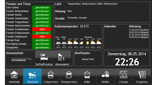

# Next generation visualization for ioBroker: vis-2 

  [](https://www.npmjs.com/package/iobroker.vis-2)
[](https://www.npmjs.com/package/iobroker.vis-2)

[](https://nodei.co/npm/iobroker.vis-2/)

WEB visualization for ioBroker platform.

## Overview
- [License requirements](#license-requirements)
- [Installation & Documentation](#installation--documentation)
- [Bindings of objects](#bindings-of-objects)
- [Filters](#filters)
- [Control interface](#control-interface)
- [Default view](#default-view)
- [Permissions System](#permissions-system)
- [Settings](#settings)
- [SVG and curentColor](#svg-and-currentcolor)

## License requirements
To use this adapter in `ioBroker` you need to accept the source code license of the adapter. The source code of this adapter is available under the CC BY-NC license.

Additionally, you need a license to use the adapter. The following license editions are available on https://iobroker.net/www/pricing 
* **Community-License: Free for private use!**: Get a free license by registering an account on [https://iobroker.net](https://iobroker.net). The license if checked online against the ioBroker license server when the vis-2 adapter is started, so an online connection at this time point is required!
* **Private use Offline-License**: For paying a small support fee, you can get rid of the required online license check on adapter startup. **Only for Private use!**
* **Commercial License**: When using Vis in a commercial environment or selling Vis as part of ioBroker packages to your customers, this license is for you. License check is also not requiring an online connection.

## Installation & Documentation




[Online Demos](https://iobroker.click/)

## Bindings of objects
Normally, most of the widgets have ObjectID attribute and this attribute can be bound with some value of object ID.
But there is another option for how to bind *any* attribute of widget to some ObjectID. 

Just write into attribute `{object.id}` e.g. `{hm-rpc.0.OEQ1880105.4.ACTUAL_TEMPERATURE}` and it will be bound to this object's value. 
If you use the special format, you can even make some simple operations with it, e.g., multiplying or formatting.

E.g., to calculate the hypotenuse of a triangle:

`{h:javascript.0.myCustom.height;w:javascript.0.myCustom.width;Math.max(20, Math.sqrt(h*h + w*w))}` will be interpreted as function:

```js
value = await (async function () {
    var h = (await getState('javascript.0.myCustom.height')).val;
    var w = (await getState('javascript.0.myCustom.width')).val;
    return Math.max(20, Math.sqrt(h * h + w * w));
})();
```

or 

`{h:javascript.0.myCustom.height;w:javascript.0.myCustom.width;h*w}` will simply multiply height with width.


You can use *any* JavaScript (browser) functions. Arguments must be defined with ':', if not, it will be interpreted as formula.

Take care about types. All of them are defined as strings. To be sure, that value will be treated as number use parseFloat function.

So our Hypotenuse calculation will be:
```
{h:javascript.0.myCustom.height;w:javascript.0.myCustom.width;Math.max(20, Math.sqrt(Math.pow(parseFloat(h), 2) + Math.pow(parseFloat(w), 2)))}
```

### Deprecated format
Patten has the following format:

```
{objectID;operation1;operation2;...}
```

The following operations are supported:

- `*` - multiplying. Argument must be in brackets, like "*(4)". In this sample, we multiply the value with 4.
- `+` - add. Argument must be in brackets, like "+(4.5)". In this sample we add to value 4.5.
- `-` - subtract. Argument must be in brackets, like "-(-674.5)". In this sample we subtract from value -674.5.
- `/` - dividing. Argument must be in brackets, like "/(0.5)". In this sample, we divide the value by 0.5.
- `%` - modulo. Argument must be in brackets, like "%(5)". In this sample, we take modulo of 5.
- `round` - round the value.
- `round(N)` - round the value with N places after point, e.g., 34.678;round(1) => 34.7
- `hex` - convert value to hexadecimal value. All letters are lower cased.
- `hex2` - convert value to hexadecimal value. All letters are lower cased. If value less 16, so the leading zero will be added.
- `HEX` - same as hex, but upper-cased.
- `HEX2` - same as hex2, but upper-cased.
- `date` - format date according to given format. Format is the same as in [iobroker.javascript](https://github.com/iobroker/iobroker.javascript/blob/master/README.md#formatdate)
- `min(N)` - if value is less than N, take the N, else value
- `max(M)` - if value is greater than M, take the M, else value
- `sqrt` - square root
- `pow(n)` - power of N.
- `pow` - power of 2.
- `floor` - Math.floor
- `ceil` - Math.ceil
- `json` - operation for getting json or object property. E.g., `{id;json(common.name.en)}`
- `random(R)` - Math.random() * R, or just Math.random() if no argument
- `formatValue(decimals)` - format value according to system settings and use decimals
- `date(format)` - format value as date. The format is like: "YYYY-MM-DD hh:mm:ss.sss"
- `momentDate(format, useTodayOrYesterday)` - format value as date using Moment.js. [Approved formats must be entered according to the moment.js library](https://momentjs.com/docs/#/displaying/format/). With `useTodayOrYesterday=true` the `moment.js` format `ddd`/`dddd` are overwritten with today / yesterday
- `array(element1,element2[,element3,element4])` - returns the element of index. e.g.: `{id.ack;array(ack is false,ack is true)}`

You can use this pattern in any text, like

```
My calculations with {objectID1;operation1;operation2;...} are {objectID2;operation3;operation4;...}
```

or color calculations:

```
#{objectRed;/(100);*(255);HEX2}{objectGreen;HEX2}{objectBlue;HEX2}
```

To show timestamp of object write `.ts` or `.lc` (for last change) at the end of object id, e.g.:

```
Last change: {objectRed.lc;date(hh:mm)}
```

### Special bindings
There are a number of different internal bindings to provide additional information in views:
* `username` - shows logged-in user
* `view` - name of actual view
* `wname` - widget name
* `widget` - is an object with all data of widget. Can be used only in JS part, like `{a:a;widget.data.name}`
* `widgetOid` - use the OID of the widget to assign the widget's value in the assignment section, like `{t:widgetOid.val;t}`
* `wid` - name of actual widget
* `language` - can be `de`, `en` or `ru`.
* `instance` - browser instance
* `login` - if login required or not (e.g., to show/hide logout button)
* `local_*` - if state name is started from `local_` it will not be reported to ioBroker but will update all widgets, that depends on this state. (Local variable for current browser session)

Note: to use ":" in calculations (e.g., in string formula) use "::" instead.

**Remember**, that style definitions will be interpreted as bindings, so use `{{style: value}}` or just

```
{
	style: value
}
```

for that.

## Filters
To visualize on the one view the whole number of widgets, you can use filters to reduce the count of widgets simultaneously shown on the view.
 
Every widget has a field `filter`. If you set it to some value, e.g. `light`, so you can use other widget `(bars - filters, filter - dropdown)` to control which filter is actually active.

## Control interface
Vis creates 3 variables:

- `control.instance` - Here the browser instance should be written or `FFFFFFFF` if every browser must be controlled.
- `control.data`     - Parameter for command. See specific command description.
- `control.command`  - Command name. Write this variable triggers the command. That means before command will be written, the "instance" and "data" must be prepared with data.

Commands:

* `alert` - show an alert window in the vis-2. "control.data" has the following format "message;title;jquery-icon". Title and jquery-icon are optional. Icon names can be found [here](http://jqueryui.com/themeroller/). To show icon "ui-icon-info" write `Message;;info`.
* `changeView` - switch to desired view. "control.data" must have the name of view. You can specify the project name too as `project/view`. The default project is `main`.
* `refresh` - reload the vis-2, for instance after the project is changed to reload on all browsers.
* `reload` - same as refresh.
* `dialog` - Show dialog window. Dialog must exist on view. One of:

    - `static    - HTML    - Dialog`,
    - `static    - Icon    - Dialog`,
    - `container - HTML    - view in jqui Dialog`,
    - `container - ext cmd - view in jqui Dialog`,
    - `container - Icon    - view in jqui Dialog`,
    - `container - Button  - view in jqui Dialog`.

    `control.data` must have id of dialog widget, e.g. `w00056`.
* `dialogClose`
* `popup` - opens a new browser window. Link must be specified in `control.data`, e.g., http://google.com
* `playSound` - play sound file. The link to file is specified in `control.data`, e.g., http://www.modular-planet.de/fx/marsians/Marsiansrev.mp3.
  You can upload your own file in vis-2 and let it play as for instance `/vis-2.0/main/img/myFile.mp3`.
  **Important** browser cannot play audio till the user has not clicked at least once on the page. It is a browser security policy. [Here](https://github.com/Hugo22O/chrome-autoplay) you can read more.

If the user changes the view or at the start, the variables will be filled by the vis-2 with

- `control.instance`: browser instance and `ack=true`
- `control.data`: project and view name in form `project/view`, e.g. `main/view` (and `ack=true`)
- `control.command`: `changedView` and `ack=true`

You can write the JSON string or Object into `control.command` as `{instance: 'AABBCCDD', command: 'cmd', data: 'ddd'}`. In this case, the instance and data will be taken from JSON object.

Example for javascript adapter:

```js
setState('vis-2.0.control.command', { instance: '*', command: 'refresh', data: ''});
```

If you write the JSON as a string, ensure that it is parseable, e.g. `{"instance": "*", "command": "refresh", "data": ""}`, note the `"`. 

## Default view
You can define for every view the desired resolution (Menu=>Tools=>Resolution).
This is only the visual border in edit mode to show you the screen size on some specific device. In the real-time mode, it will not be visible and all widgets outside the border will be visible.  

Additionally, you can define if this view must be used as default for this resolution. 

So every time the `index.html` (without `#viewName`) is called, the best suitable for this resolution view will be opened.
If only one view has *"Default"* flag, so this view will be opened independently of screen resolution or orientation.      

E.g., you can create two views "Landscape-Mobile" and "Portrait-Mobile" and these two views will be switched automatically when you change the orientation or screen size.

There is a helper widget "basic - Screen Resolution" that shows actual screen resolution and best suitable default view for this resolution. 

## Permissions System
### Project
In the project management dialog, you can configure `read` and `write` permissions for each ioBroker user.

The `read` flag means that the project is accessible for this user in the Runtime. 
The `write` flag means that the project is accessible for this user in the Edit Mode.

When a new user is created via ioBroker Admin adapter, it will have both permissions by default.

### View
You can also specify which views the user is allowed to access for runtime and edit mode. 
When one of the access rights is not granted on project level, it does not have any effect to specify them on view level, as the project as a whole will not be accessible.

Note that whenever you try to access a view, where the current user has no permission for, the user will see the project selection panel instead.

### Widget
If the user has no `read` permissions, the widget will not be rendered in the runtime. If user has no `write` permissions, the widget
will not be rendered in edit mode.

## Settings
### Reload if sleep longer than
There is a rule that after some disconnection period, the whole VIS page will be reloaded to synchronize the project.
You can configure it in the menu "Settings...". If you set the interval to "never", so the page will never be reloaded.

### Reconnect interval
Set the interval between the connection attempts if disconnected. If you set 2 seconds, it will try to establish the connection every 2 seconds.

### Dark reconnect screen
Sometimes (in the night) it is required to have the dark loading screen. With this option, you can set it.

Notice that these settings are valid only for reconnection and not for the first connecting.


## SVG and currentColor
The currentColor keyword in CSS allows elements to inherit the current text color from their parent element.
It can be particularly useful in SVGs (Scalable Vector Graphics) because it allows for more dynamic styling and easier integration with HTML content.

You can use the currentColor keyword in place of a specific color value for any property inside the SVG that accepts a color value.
Here's a simple example with a circle in an SVG:
```xml
<svg width="100" height="100" xmlns="http://www.w3.org/2000/svg">
    <circle cx="50" cy="50" r="40" fill="currentColor" />
</svg>
```
In this case, if the SVG takes the color of parent element.
E.g., if it was used in a menu and the menu is red, the circle would be red.

## Development and Debugging

In order to make adjustments to the vis-2 editor itself, to search for errors and to debug, the following steps must be carried out.

1. fork the iobroker/iobroker.vis-2 repository into your own account via user interface of GitHub

2. clone the repository into a directory. copy the url from your GitHub repository. the command looks like

```shell
git clone https://github.com/<your profile name>/ioBroker.vis-2.git
```

3. open the downloaded repository with your IDE

4. to install and download all necessary libraries, run the following command in a terminal in the root directory of the repository

```shell
npm run install-monorepo
```

5. to start the editor in the browser, please execute the following command. 
An already separately running iobroker server instance must be available on port 8082.

```shell
npm run start
```

- Debugging is available in the browser e.g. chrome F12
- if you change a file, automatic reload of the editor is supported

## Todo
<!--
    Placeholder for the next version (at the beginning of the line):
    ### **WORK IN PROGRESS**
-->
## Changelog
### **WORK IN PROGRESS**
* (@GermanBluefox) Fixed loading of widgets on the cloud

### 2.13.0 (2025-08-24)
* (@GermanBluefox) Added possibility to define SVG icon sets from widgets sets

### 2.12.12 (2025-07-20)
* (@foxriver76) enabled the local binding states for widgets

### 2.12.11 (2025-07-01)
* (@GermanBluefox) Corrected selection of the view for resolution
* (@GermanBluefox) Added option to ignore the unloaded widgets in runtime
* (@oweitman) Corrected the user defined resolution for the view

### 2.12.10 (2025-05-25)
* (@GermanBluefox) Added possibility to define favicon and browser tab title

### 2.12.9 (2025-05-19)
* (@GermanBluefox) Added possibility to use value in signal text

## License
 Copyright (c) 2021-2025 Denis Haev, https://github.com/GermanBluefox <dogafox@gmail.com>,
  
 Creative Common Attribution-NonCommercial (CC BY-NC)

 http://creativecommons.org/licenses/by-nc/4.0/


Short content:
Licensees may copy, distribute, display and perform the work and make derivative works based on it only if they give the author or licensor the credits in the manner specified by these.
Licensees may copy, distribute, display, and perform the work and make derivative works based on it only for noncommercial purposes.
(Free for non-commercial use).
