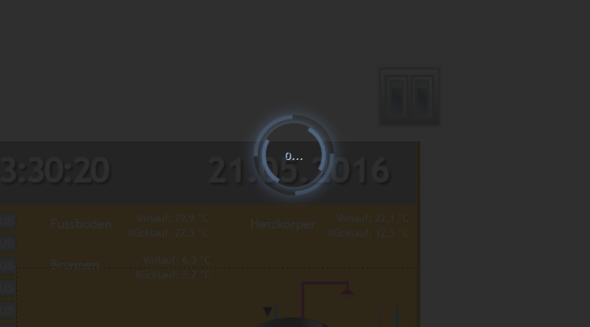

# Visualisation

  [](https://www.npmjs.com/package/iobroker.vis)
[](https://www.npmjs.com/package/iobroker.vis)

[](https://nodei.co/npm/iobroker.vis/)

WEB visualisation for ioBroker platform.

## License requirements
To use this adapter in ioBroker you need to accept the source code license of the adapter. The source code of this adapter is available under the CC BY-NC license.

Additionally, you need a license to use the adapter. The following license editions are available on https://iobroker.net/www/pricing 
* **Community-License: Free for private use!**: Get a free license by registering an account on https://iobroker.net . The license if checked online against the ioBroker license server when the vis adapter is started, so an online connection at this timepoint is required!
* **Private use Offline-License**: For paying a small support fee you can get rid of the required online license check on adapter startup. **Only for Private use!**
* **Commercial License**: When using Vis in a commercial environment or selling Vis as part of ioBroker packages to your customers this license is for you. License check is also not requiring an online connection.

## Installation & Documentation


[Online Demos](https://iobroker.click/)

## Bindings of objects
Normally, most of the widgets have ObjectID attribute and this attribute can be bound with some value of object ID.
But there is another option how to bind *any* attribute of widget to some ObjectID. 

Just write into attribute ```{object.id}``` and it will be bound (not in edit mode) to this object's value. 
If you use the special format, you can even make some simple operations with it, e.g. multiplying or formatting.
Patten has the following format:

```
{objectID;operation1;operation2;...}
```

Following operations are supported:

- `\*` - multiplying. Argument must be in brackets, like "*(4)". In this sample we multiply value with 4.
- `\+` - add. Argument must be in brackets, like "+(4.5)". In this sample we add to value 4.5.
- `\-` - subtract. Argument must be in brackets, like "-(-674.5)". In this sample we subtract from value -674.5.
- `/` - dividing. Argument must be in brackets, like "/(0.5)". In this sample we divide value by 0.5.
- `%` - modulo. Argument must be in brackets, like "%(5)". In this sample we take modulo of 5.
- `round` - round the value.
- `round(N)` - round the value with N places after point, e.g. 34.678;round(1) => 34.7
- `hex` - convert value to hexadecimal value. All letters are lower cased.
- `hex2` - convert value to hexadecimal value. All letters are lower cased. If value less 16, so the leading zero will be added.
- `HEX` - same as hex, but upper-cased.
- `HEX2` - same as hex2, but upper-cased.
- `date` - format date according to given format. Format is the same as in [iobroker.javascript](https://github.com/iobroker/iobroker.javascript/blob/master/README.md#formatdate)
- `min(N)` - if value is less than N, take the N, else value
- `max(M)` - if value is greater than M, take the M, else value
- `sqrt` - square root
- `pow(n)` - power of N.
- `pow` - power of 2.
- `floor` - Math.floor
- `ceil` - Math.ceil
- `random(R)` - Math.random() * R, or just Math.random() if no argument
- `formatValue(decimals)` - format value according to system settings and use decimals
- `date(format)` - format value as date. Format is like: "YYYY-MM-DD hh:mm:ss.sss"
- `momentDate(format, useTodayOrYesterday)` - format value as date using Moment.js. [Approved formats must be entered according to the moment.js library](https://momentjs.com/docs/#/displaying/format/). With `useTodayOrYesterday=true` the momentjs format `ddd`/`dddd` are overwritten with today / yesterday
- `array(element1,element2[,element3,element4])` - returns the element of index. e.g.: `{id.ack;array(ack is false,ack is true)}`

You can use this pattern in any text, like

```
My calculations with {objectID1;operation1;operation2;...} are {objectID2;operation3;operation4;...}
```

or color calculations:

```
#{objectRed;/(100);*(255);HEX2}{objectGreen;HEX2}{objectBlue;HEX2}
```

To show timestamp of object write `.ts` or `.lc` (for last change) at the end of object id, e.g.:

```
Last change: {objectRed.lc;date(hh:mm)}
```

There is another possibility to write the pattern:

```
Hypotenuse of {height} and {width} = {h:height;w:width;Math.max(20, Math.sqrt(h*h + w*w))}
```

`{h:height;w:width;h*w}` will be interpreted as function:

```
value = (function () {
    var h = "10";
    var w = "20";
    return Math.max(20, Math.sqrt(h*h + w*w));
})();
```

You can use *any* javascript functions. Arguments must be defined with ':', if not, it will be interpreted as formula.

Take care about types. All of them defined as strings. To be sure, that value will be treated as number use parseFloat function.

```
Hypotenuse of {height} and {width} = {h:height;w:width;Math.max(20, Math.sqrt(Math.pow(parseFloat(h), 2) + Math.pow(parseFloat(w), 2)))}
```

### Special bindings
There are a number different internal bindings to provide additional information in views:
* `username` - shows logged-in user
* `view` - name of actual view
* `wname` - widget name
* `widget` - is an object with all data of widget. Can be used only in JS part, like `{a:a;widget.data.name}`
* `wid` - name of actual widget
* `language` - can be `de`, `en` or `ru`.
* `instance` - browser instance
* `login` - if login required or not (e.g. to show/hide logout button)
* `local_*` - if state name is started from `local_` it will not be reported to ioBroker but will update all widgets, that depends on this state. (Local variable for current browser session)

Note: to use ":" in calculations (e.g. in string formula) use "::" instead.

**Remember**, that style definitions will be interpreted as bindings, so use `{{style: value}}` or just

```
{
	style: value
}
```

for that.

## Filters
To visualise on the one view thw whole number of widgets you can use filters to reduce the amount of widgets simultaneously shown on the view.
 
Every widget has a field `filter`. If you set it to some value, e.g. `light`, so you can use other widget `(bars - filters, filter - dropdown)` to control which filter is actually active.

## Control interface
Vis creates 3 variables:

- `control.instance` - Here the browser instance should be written or `FFFFFFFF` if every browser must be controlled.
- `control.data`     - Parameter for command. See specific command description.
- `control.command`  - Command name. Write this variable triggers the command. That means before command will be written the "instance" and "data" must be prepared with data.

Commands:

* `alert` - show alert window in the vis. "control.data" has the following format "message;title;jquery-icon". Title and jquery-icon are optional. Icon names can be found [here](http://jqueryui.com/themeroller/). To show icon "ui-icon-info" write ```Message;;info```.
* `changeView` - switch to desired view. "control.data" must have the name of view. You can specify project name too as "project/view". Default project is "main".
* `refresh` - reload the vis, for instance after project is changed to reload on all browsers.
* `reload` - same as refresh.
* `dialog` - Show dialog window. Dialog must exist on view. One of:

    - `static    - HTML    - Dialog`,
    - `static    - Icon    - Dialog`,
    - `container - HTML    - view in jqui Dialog`,
    - `container - ext cmd - view in jqui Dialog`,
    - `container - Icon    - view in jqui Dialog`,
    - `container - Button  - view in jqui Dialog`.

    `control.data` must have id of dialog widget, e.g. `w00056`.
* `dialogClose`
* `popup` - opens a new browser window. Link must be specified in `control.data`, e.g. http://google.com
* `playSound` - play sound file. The link to file is specified in `control.data`, e.g. http://www.modular-planet.de/fx/marsians/Marsiansrev.mp3.
  You can upload your own file in vis and let it play as for instance `/vis.0/main/img/myFile.mp3`.

If user changes the view or at start the variables will be filled by the vis with

- `control.instance`: browser instance and `ack=true`
- `control.data`: project and view name in form `project/view`, e.g. `main/view` (and `ack=true`)
- `control.command`: `changedView` and `ack=true`

You can write the JSON-string or Object into `control.command` as `{instance: 'AABBCCDD', command: 'cmd', data: 'ddd'}`. In this case the instance and data will be taken from JSON object.

Example for javascript adapter:

```
setState('vis.0.control.command', {"instance": "*", "command": "refresh", "data": ""});
```

## Default view
You can define for every view the desired resolution (Menu=>Tools=>Resolution). This is only the visual border in edit mode to show you the screen size on some specific device. In real time mode it will not be visible and all widgets outside of border will be visible.  

Additionally, you can define if this view must be used as default for this resolution. 

So every time the `index.html` (without `#viewName`) is called, the best suitable for this resolution view will be opened.
If only one view has *"Default"* flag, so this view will be opened independently of screen resolution or orientation.      

E.g. you can create two views "Landscape-Mobile" and "Portrait-Mobile" and these two views will be switched automatically when you change the orientation or screen size.

There is a helper widget "basic - Screen Resolution" that shows actual screen resolution and best suitable default view for this resolution. 

## Settings
### Reload if sleep longer than
There is a rule, that after some disconnection period the whole VIS page will be reloaded to synchronise the project.
You can configure it in the menu "Settings...". If you set interval to "never" so the page will never be reloaded.

### Reconnect interval
Set the interval between the connection attempts if disconnected. If you set 2 seconds, it will try to establish the connection every 2 seconds.

### Dark reconnect screen
Sometimes (in the night) it is required to have dark loading screen. With this option you can set it.

Notice that these settings are valid only for reconnection and not for the first connect.



<!--
    Placeholder for the next version (at the beginning of the line):
    ### **WORK IN PROGRESS**
-->
## Changelog
### 1.4.15 (2022-04-10)
* (bluefox) Better check of the offline license

### 1.4.14 (2022-03-31)
* (bluefox) Corrected GUI bug

### 1.4.13 (2022-03-22)
* (pascal-hari) The group attributes will be replaced recursively

### 1.4.12 (2022-02-12)
* (bluefox) Fixed bug with the export of specific widgets

### 1.4.11 (2022-02-12)
* (bluefox) Removed ES6 commands to be supported by older browsers
* (oweitman) Fixed problem with update of grouped widgets
* (stephanritscher) Added web manifest to be able to handle vis as the web app

### 1.4.8 (2022-01-29)
* (bluefox) Added support for js-controller 4.x

### 1.4.7 (2021-12-28)
* (mswiege) Fixed subscribeOidAtRuntime if called with invalid IDs
* (bluefox) Added support of license manager

### 1.4.6 (2021-11-20)
* (bluefox) Added the license check even without internet

### 1.4.5 (2021-10-08)
* (jens-maus) Added frame-src spec to content-security-policy header fixing frame related content blocking issues (e.g. using KioskPro iOS app).
* (bluefox) Showed the extended error messages by license check
* (Scrounger) Patch visibility oid binding

### 1.4.4 (2021-08-31)
* (jobe451) Allowed to have ":" in the binding object IDs

### 1.4.3 (2021-07-11)
* (bluefox) Added possibility to check license offline (only special once)

### 1.4.0 (2021-07-01)
* (bluefox) Changed path for check of certificates 
* (thost96) fixes for issues found by adapter-checker

### 1.3.10 (2021-05-25)
* (bluefox) Fixed the support of admin5

### 1.3.9 (2021-04-29)
* (agav99) Added support of local browser variables
* (Scrounger) Bug fix for null & NaN values in width and height
* (bluefox) Added support for admin5

### 1.3.8 (2021-03-03)
* (bluefox) fix play sounds on iOS Safari an android
* (Scrounger) visEditInspect: format dimension added
* (foxriver76) Replace travis and appveyor by the GitHub actions
* (Excodibur) Allow resources to be loaded as blob
* (Excodibur ) Allow resources to be loaded as blob

### 1.3.7 (2021-01-20)
* (Scrounger) Bug Fixed - Binding in JSON string

### 1.3.6 (2020-12-13)
* (twonky4) Corrected: old browser issue
* (rbaranga) Corrected: play sounds on iOS Safari
* (Scrounger) Added the optional arguments to support Material Design Widgets

### 1.3.4 (2020-10-04)
* (foxriver76) Corrected the error on older devices

### 1.3.3 (2020-09-21)
* (bluefox) Return de-bounce settings back
* (bluefox) Corrected error with {username} binding
* (bluefox) Fixed "show last change" option

### 1.3.1 (2020-09-18)
* (bluefox) Added the auto-focus option to the input widgets

### 1.3.0 (2020-09-17)
* (foxriver76) on pending getStates, try again instead of drop
* (foxriver76) fixed the file manager typos
* (Scrounger) Added momentDate for the bindings

### 1.2.12 (2020-09-08)
* (foxriver76) only parse arrays and json objects, not booleans, normal strings etc

### 1.2.11 (2020-08-25)
* (bluefox) The error message about the non-found chart view was fixed.

### 1.2.10 (2020-08-23)
* (gsicilia82/fceller) JSON strings will be parsed in VIS bindings

### 1.2.9 (2020-08-22)
* (bluefox) Charts are now supported

### 1.2.6 (2020-03-22)
* (bluefox) Added the better error message if license could not be parsed

### 1.2.4 (2020-02-11)
* (bluefox) Table widget was extended with the selected object ID.

### 1.2.3 (2019-12-14)
* (bluefox) Small changes in license handling were made

### 1.2.2 (2019-10-27)
* (bluefox) Preparations for js-controller 2.0. Check undefined adn null.

### 1.2.1 (2019-09-10)
* (bluefox) fixed upload of files

### 1.2.0 (2019-05-07)
* (bluefox) add translations

### 1.1.11 (2019-02-07)
* (bluefox) improve Bool HTML

### 1.1.10 (2019-01-30)
* Add Chinese support

### 1.1.8 (2018-10-29)
* (bluefox) File dialog was corrected

### 1.1.7 (2018-07-24)
* (bluefox) view8 corrected

### 1.1.6 (2018-07-18)
* (bluefox) support of new variables (see [Special bindings](#special-bindings) )
* (bluefox) fix error if fast view changes
* (bluefox) fix "jqui - ctrl - IconState / val - Icon Bool"

### 1.1.5 (2018-06-10)
* (bluefox) show more information if widget cannot be rendered
* (bluefox) fix saving of widgets if they have bindings
* (bluefox) show error stack
* (bluefox) fix binding
* (Apollon77) fix testing
* (bluefox) fix for iobroker.pro and external socket.io settings
* (bluefox) A user variable was added into bindings.
* (bluefox) Fixed widget tabs

### 1.1.4 (2018-04-23)
* (bluefox) fix bool SVG

### 1.1.3 (2018-04-12)
* (bluefox) ignore click by scrolling on touch devices
* (bluefox) remove wrong state vis.0.command
* (bluefox) fix error with jPlot
* (bluefox) better widget behaviour in edit Mode (basic, jqui)
* Fix config dialog

### 1.1.2 (2018-02-02)
* (bluefox) Fixing the saving of project
* (bluefox) Fixing the background selector
* (bluefox) Fixing the null pointer problem
* (bluefox) Fixing the selection helper
* Update translations

### 1.1.1 (2018-01-07)
* (bluefox) The problem with view change on the touch devices fixed

### 1.0.5 (2017-11-19)
* (bluefox) show number of data points in every project

### 1.0.4 (2017-10-22)
* (bluefox) Add autocomplete for view CSS options
* (bluefox) change edit of view CSS background options

### 1.0.3 (2017-10-20)
* (bluefox) Fix parse of invalid bindings
* (bluefox) add moment.js

### 1.0.0 release candidate (2017-10-13)
* (bluefox) fix iframe and image updates
* (bluefox) fix fonts

### 0.15.7 (2017-10-01)
* (bluefox) allow update of images without additional query (but it works only in some very specific cases)
* (bluefox) zoom of iframes

### 0.15.5 (2017-07-24)
* (bluefox) Fix widgets upload

### 0.15.4 (2017-07-19)
* (bluefox) Add swipe

### 0.15.3 (2017-07-12)
* (bluefox) Add full screen widget
* (bluefox) Fix timestamp widget

### 0.15.2 (2017-07-07)
* (bluefox) Fix binding if it has "-" in the OID

### 0.15.1 (2017-06-30)
* (bluefox) Fix error with context menu
* (bluefox) Allow adding of class to view

### 0.15.0 (2017-05-25)
* (bluefox) fix copy of grouped widgets
* (bluefox) fix subscribe if empty states

### 0.14.7 (2017-05-19)
* (bluefox) add templates

### 0.14.6 (2017-05-16)
* (bluefox) Fix error by groups selection
* (apollon77) fix jqui-dialog for auto-open

### 0.14.3 (2017-05-11)
* (bluefox) fix export/import of grouped widgets

### 0.14.2 (2017-04-29)
* (bluefox) Fix install error

### 0.14.1 (2017-04-27)
* (bluefox) move beta to main
* (bluefox) fix choose filter
* (bluefox) fix error if some views do not exist
* (bluefox) fix binding problem, e.g. "a:-45?0" was detected as variable too.
* (bluefox) fix some font sizes
* (bluefox) fix undo
* (bluefox) fix themes change
* (bluefox) optimize load of pages
* (bluefox) check license
* (bluefox) fix basic views 8
* (bluefox) fix time picker if opened in dialog

### 0.14.0 (2017-04-10)
* (bluefox) add mandatory license input

### 0.12.7 (2017-02-09)
* (bluefox) prepare beta

### 0.12.6 (2017-01-29)
* (pmant) fix view copy
* (pmant) Improvements to context menu
* (pmant) usability improvements for both view dropdowns
* (bluefox) small fix of dragging

### 0.12.6 (2017-01-29)
* (pmant) add dropdown menu to views bar
* (pmant) sort widgets widget selector by name
* (bluefox) fix groupAttr in signals and visibility

### 0.12.2 (2016-12-04)
* (bluefox) fix errors with grouping

### 0.12.1 (2016-11-30)
* (bluefox) fix errors with containers

### 0.12.0 (2016-11-24)
* (bluefox) subscribe mode for faster state loading
* (bluefox) add grouping

### 0.10.15 (2016-11-06)
* (bluefox) remove weather-adapter.html
* (bluefox) clean config.js
* (bluefox) remove old widgets
* (bluefox) improve authentication in app
* (bluefox) allow creation of instance from helper widget

### 0.10.14 (2016-10-09)
* (bluefox) fix rendering of widgets
* (bluefox) working on relative positions.
* (bluefox) destroy widgets before views deletion

### 0.10.13 (2016-09-23)
* (bluefox) fixed errors for iPad 1
* (bluefox) start working on relative positions

### 0.10.12 (2016-09-16)
* (bluefox) group specific visibility of widgets and views

### 0.10.11 (2016-09-15)
* (bluefox) fix for iOS 10
* (bluefox) allow disabling of groups for performance

### 0.10.10 (2016-09-14)
* (bluefox) add text2speech widget
* (bluefox) try to fix problem with iOS 10

### 0.10.9 (2016-09-04)
* (bluefox) support of web-sockets force
* (bluefox) destroy unused views after 30 seconds
* (bluefox) do not show middle leading lines if top and bottom are shown
* (bluefox) let timestamp and last-change to show time as interval

### 0.10.7 (2016-07-09)
* (bluefox) add settings to reload vis
* (bluefox) add dark reload screen
* (bluefox) fix reload interval
* (bluefox) export/import
* (bluefox) add global script
* (bluefox) add 'not exist'/'not consist'/'exist' to signal and visibility
* (bluefox) fix OIDs in editor

### 0.10.5 (2016-06-15)
* (bluefox) fix select ID dialog
* (bluefox) add align help lines
* (bluefox) never store data in non-edit mode

### 0.10.4 (2016-06-14)
* (bluefox) fix drag and resize
* (Patrick) fix QuoJS
* (bluefox) support of milliseconds in formatDate
* (bluefox) support of getHistory
* (bluefox) support of show history instances
* (bluefox) grid
* (bluefox) add previews

### 0.10.3 (2016-05-30)
* (bluefox) update canJS
* (pmant) fixes bugs with dialogs on touchscreens
* (bluefox) speedUP show attributes at 300ms
* (bluefox) fix click on widget if signal is active

### 0.10.2 (2016-05-24)
* (bluefox) fix widgets with timestamps

### 0.10.1 (2016-05-23)
* (bluefox) change version

### 0.10.0 (2016-05-23)
* (bluefox) translates
* (bluefox) fix 'no widgets selected'
* (bluefox) change widget icons
* (bluefox) add signals
* (bluefox) add app.css for cordova
* (bluefox) change icons preview
* (bluefox) show properties of widget as icon
* (bluefox) fix error with external commands
* (bluefox) add types icon to preview
* (bluefox) support edit on iPad1
* (bluefox) change security settings

## License
 Copyright (c) 2013-2022 bluefox, https://github.com/GermanBluefox <dogafox@gmail.com>,
 
 Copyright (c) 2013-2014 hobbyquaker, https://github.com/hobbyquaker <hobbyquaker@gmail.com>,
 
 Creative Common Attribution-NonCommercial (CC BY-NC)

 http://creativecommons.org/licenses/by-nc/4.0/


Short content:
Licensees may copy, distribute, display and perform the work and make derivative works based on it only if they give the author or licensor the credits in the manner specified by these.
Licensees may copy, distribute, display, and perform the work and make derivative works based on it only for noncommercial purposes.
(Free for non-commercial use).
